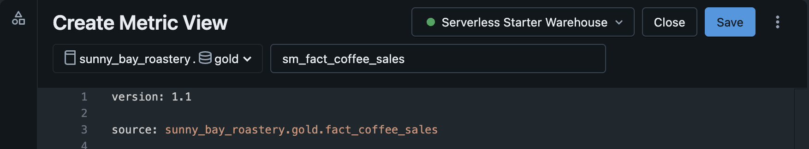

# ☕ Lab 2 – Data Modelling: Bring Context and Business Semantics to your data

## 🎯 Learning Objectives
By the end of this lab, you will:
- Understand how [Databricks Metric Views](https://learn.microsoft.com/azure/databricks/metric-views/) will allow you to add business semantics using relationships and calculations to your data
- Create a metric view with
    - relationships to our tables to allow implicit joining of tables.
    - dimensions and measures with attributes and common calcutions
    - formating instructions and synomyns
- Publish the metric view to make it available in Unity Catalog to make it accessable by subsequent features and tools such as Databricks Dashboards.

## Introduction

**What Are Metric Views?**

Metric views are reusable semantic models in Databricks that define business logic for KPIs, calculations, joins, and dimensions in a standardized way.

They allow consistent reporting, simplify complex SQL logic, and centralize metric definitions for dashboards, notebooks, and BI tools.​

**Why Use Metric Views?**

- Ensure “one version of the truth” by standardizing metrics and calculations organization-wide.

- Enable flexible exploration of metrics across any dimension (e.g., sales by product, region, or time) without rebuilding SQL queries.

- Simplify maintenance—updates to metrics or logic are immediately available across all downstream reports and tools.

- Add business context via synonyms, comments, and formatting for user-friendly analytics.​


## Instructions

### Create am empty Metric View

1. Navigate to the gold schema using the Catalog Explorer and create a new Metric View by selecting it after clicking the New Button. Name it ``sm_fact_coffee_sales``. 


2. Delete the provided sample code. You will create your own Metric View from scratch.

### Add table relationships to the Metric View

1. Define your source, which is the base table of the metric view and typically the center of our star/snowflake schema. In your case, this will be `sunny_bay_roastery.gold.fact_coffee_sales`. Copy the following code snippet at the top of your metric view definition. Note that the version attribute determines which features are available. We will use version 1.1.

```YAML
version: 1.1

source: sunny_bay_roastery.gold.fact_coffee_sales 
```

2. Add your first join to a dimension table. Specify the dimension the table `sunny_bay_roastery.gold.dim_product` and the join key `source.product_key = product.product_key` to define the relationship of the dimenesion table and the fact table.

```YAML
  - name: product
    source: sunny_bay_roastery.gold.dim_product
    "on": source.product_key = product.product_key
```
3. Add another join yourself using the same approach. Use our date dimension which is stored in the table `sunny_bay_roastery.gold.dim_date`. The join column are named `date_key` on both tables. For the name attribute, set "date".

4. Add a final join to the store dimension table named `sunny_bay_roastery.gold.dim_store`. The join columns are named `store_key` on both sides. For the name attribute, set "store".

5. Provide the name **`sm_fact_coffee_sales`** and save the Metric View by clicking the Save button at the right top corner. If everything is defined correctly, the Metric View will be saved and is immediately available in Unity Catalog. 




### Define Dimensional Attributes

1. Now that we have our joins defined, we can select, which dimensional attributes our Metric View should contain. We can automically select all that exist by simply adding the table name as an expression which will add a column with an array of all attributes. This his will bloat and add complexity that might not be helpful to end users. Instead you will select the product name by adding the follwing snippet:

```YAML
dimensions:
  - name: product_name
    expr: product.product_name
    display_name: Product Name
```
2. Add two more dimension attributes from the **product** dimension table. Select the following attributes: 
    - Product category (product.product_category)
    - Product subcategory (product.product_subcategory)
 
3. Since you also joined the **date** dimension table in the previous section, add the following attribute from the date dimension:
    - Date (date.date)

4. Finally, add the following attribute from the **store** dimension table>
    - Store Name (store.store_name)
    - Is Online Store (store.is_online)
    - Store Latitude (store.latitude)
    - Store Longitude (store.longitude)

4. Save your progress and troubleshoot your definition in case you see any errors.

### Define Measures

1. As the last step, create a basic measure which will sum the total sales quantities. The approach is very similar. Add the following code snippet to the buttom of your Metric View definition:
```YAML
measures:
  - name: total_net_revenue_usd
    expr: SUM(net_revenue_usd)
```

2. Add a second measure that will sum our total gross revenue. The column that stores this metric is named `cost_of_goods_usd`. The name of the measure should be "total_cost_of_goods"

3. We will add third measure named `total_net_profit`, that will substract the second measure `total_cost_of_goods` from the first measure `total_net_revenue_usd`. This will be our profit. The expression is `measure(total_net_revenue_usd) - measure(total_cost_of_goods)`.

3. Save your progress and troubleshoot your definition in case you see any errors.

### Final steps

You have now published the Metric View to Unity Catalog by saving the YAML. This makes the metric view discoverable and available to teams and tools, including Databricks Dashboards and downstream analytics, provided they have access enherited from the schema. 

If you got any errors you couldn't resolve yourself, review the full definition and compare with your results:

```YAML
version: 1.1

source: sunny_bay_roastery.gold.fact_coffee_sales

joins:
  - name: product
    source: sunny_bay_roastery.gold.dim_product
    "on": source.product_key = product.product_key
  - name: date
    source: sunny_bay_roastery.gold.dim_date
    "on": source.date_key = date.date_key
  - name: store
    source: sunny_bay_roastery.gold.dim_store
    "on": source.store_key = store.store_key

comment: "Metric view for analyzing Sunny Bay Coffee sales online and office, including\
  \ Customer and Product analytics."

dimensions:
  - name: product_name
    expr: product.product_name
    display_name: Product Name
  - name: product_category
    expr: product.product_category
    display_name: Product Category
  - name: product_subcategory
    expr: product.product_subcategory
    display_name: Product Subcategory
  - name: date
    expr: date.date
    display_name: Date
  - name: store_name
    expr: store.store_name
    display_name: Store Name
  - name: store_online
    expr: store.is_online
    display_name: Store Online
  - name: store_latitude
    expr: store.latitude
    display_name: Store Latitude
  - name: store_longitude
    expr: store.longitude
    display_name: Store Longitude

measures:
  - name: total_net_revenue_usd
    expr: SUM(net_revenue_usd)
  - name: total_cost_of_goods
    expr: SUM(cost_of_goods_usd)
  - name: total_net_profit
    expr: measure(total_net_revenue_usd) - measure(total_cost_of_goods)
```

## What Happens Next?

You created a simple Metric View and users will be able to directly query business metrics without writing SQL joins or recalculating KPIs.

On purpose, you did not yet use any advanced features such as complex calulations, synomyns, formatting, etc. We encourage you to look into more advanced calculations and modelling capabilites such as:

**Different aggregation functions:**
```YAML 
  - name: max_net_revenue_usd
    expr: MAX(net_revenue_usd)
  - name: avg_cost_of_goods
    expr: AVG(cost_of_goods_usd)
```
    
**Windowing calcuations such as rolling averages, previous period and running totals:**
```YAML 
  - name: total_gross_revenue_usd_previous_day
    expr: measure(`total_gross_revenue_usd`)
    window:
      - order: date_date
        semiadditive: last
        range: trailing 1 day
```
**Number formatting and synomyns:**
```YAML
  - name: total_gross_revenue_usd
    expr: SUM(`gross_revenue_usd`)
    comment: Total gross revenue in USD before VAT and costs
    display_name: Total Gross Revenue (USD)
    format:
      type: currency
      currency_code: USD
      decimal_places:
        type: exact
        places: 2
      abbreviation: compact
    synonyms:
      - revenue
      - gross revenue
```

Review [provided YAML](./Artifacts/metric_view.yaml) template for reference. This structure includes source, joins, detailed dimensions, measures with formulas, business-friendly display names, and formatting. 

**Important:** You will need this Metric View in a subsequent section. Please create it with the name `sm_fact_coffee_sales_genie`.

Once both Metric Views are available in Unity Catalog, proceed to the next section. 
