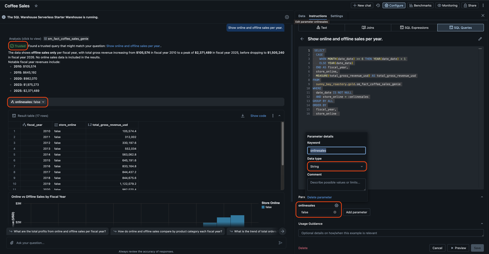
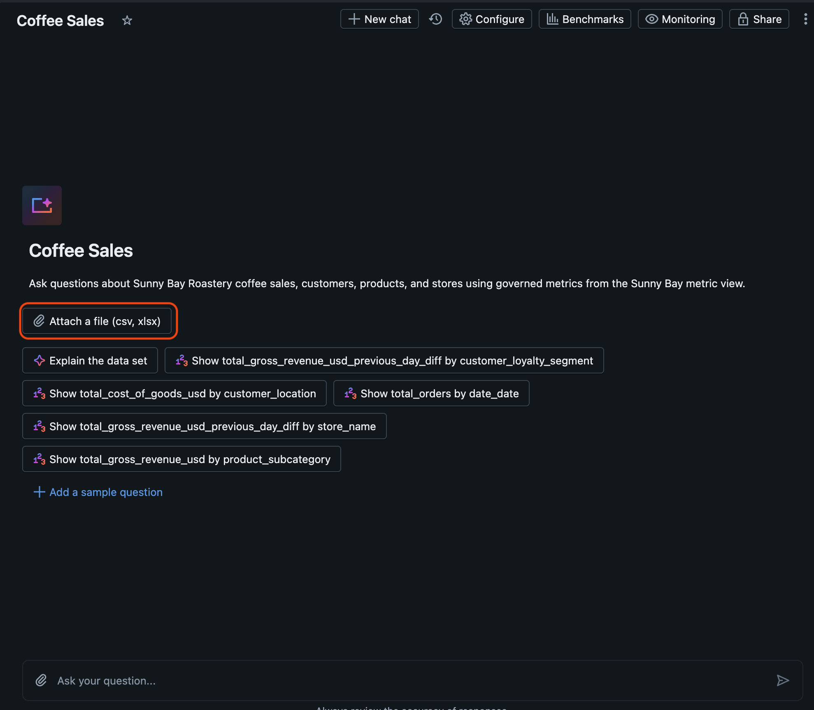
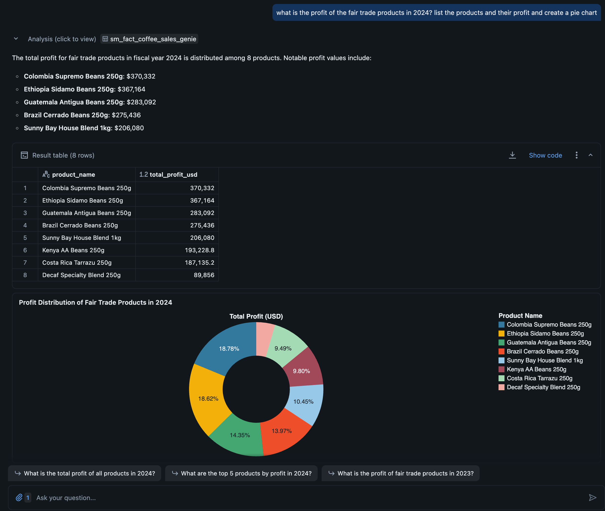

# 🧪 Lab 4 – Exploring Databricks Genie with the Sunny Bay Metric View

## 🎯 Learning Objectives

By the end of this lab, you will be able to:

- Use a Unity Catalog metric view (Sunny Bay Coffee Sales) as the main dataset for a Genie space.  
- Ask natural-language questions in Genie and interpret the generated SQL and visualizations.  
- Evaluate and benchmark the quality of Genie’s answers using sanity checks and reference queries.  

## Introduction

**What Is Databricks Genie?**

Databricks Genie is an AI-powered, natural-language interface that lets business users ask questions about their data in plain English and get back answers as tables, charts, and summaries without writing SQL or building reports first. It sits on top of governed datasets like Unity Catalog metric views, so all insights respect existing security, governance, and business definitions.

With Genie, teams can:
- Go beyond static dashboards and get on‑the‑fly answers to new questions that weren’t pre-modeled in reports.
- Self‑serve insights using conversational prompts, reducing dependency on data engineers and analysts for every new question.
- Rely on consistent metrics and semantics defined in Unity Catalog and the Genie knowledge store, improving accuracy and trust in results. 

## Instructions

Before you start, please verify:
- The **Sunny Bay Coffee Sales metric view** from Lab 2 is created and published in Unity Catalog.  
- A **SQL warehouse** (Pro or serverless) is available and selectable for Genie queries.  

### Create the “Sunny Bay Sales Genie” Space

1. In the Databricks workspace, open **Genie** from the left navigation.  
2. Click **New space**.  


3. Under **Data sources** (or equivalent section), **add the Sunny Bay Coffee metric view** that you defined in Lab 2 named `sm_fact_coffee_sales_genie`


4. Once the Genie space is created, fill in the basic information under "Configure" -> "Settings" :
   - **Title:** `Sunny Bay Sales Genie`  
   - **Description:**   “Ask questions about Sunny Bay Roastery coffee sales, customers, products, and stores using governed metrics from the Sunny Bay metric view.”  
   


5. Select a **Pro or serverless SQL warehouse** to run queries.  
6. Click **Save** to save the changes to the Genie space.  
7. In the Genie space settings:
- Configure knowledge / context text (“Instructions” box):
    - Describe the business context: Sunny Bay Roastery, coffee sales, currencies, time grain, etc. 
    - Clarify metric meanings
    - Specify standard aggregations and filters (e.g., “Prefer last 30 days when no date is specified”).
    - To save you from typing, you can past [this text](../Participant%20Assets/Artifacts/Genie_Instructions.txt).
    


8. You can now ask a first question to Genie and it should give acceptable results. For example, you can type **Show me the profit by month for the year 2023 as a bar chart** in the chat window, which should provide the following output:


9. (Optional) By clicking on `Show SQL`, you can review the SQL query that Genie created to select data from your Metric View.


### Optimize the Genie Space for High Quality (Knowledge & Semantics)

#### Additional context

1. Let's assume that your Fiscal year doesn't match the Calendar year. It instead stretches from June 1st to May 31st. Add this item to the instructions from the previous section: `* whenever users are asking about dates, use the fiscal year instead of the calendar year. It starts on June 1st and ends on May 31st.`

2. Open a new chat to reflect the updated instructions and ask the same question. Genie should now adjust the selected months to the defined fiscal year.


3. Review the changed time selector and optionally the SQL query that was updated equally.

#### SQL Queries

1. Additionally, you can add a provided SQL query. The purpose is to provide a SQL query yourself for a given question instead of letting Genie generate it. For frequently asked questions, this will provide a higher level of trust to users. Navigate to the instruction setting and open the `SQL Queries` pane. 

5. The question we want to provide a query for will be `Show online and offline sales per year.` For the SQL query, provide this one:

```SQL
SELECT
  CASE
    WHEN MONTH(date_date) >= 6 THEN YEAR(date_date) + 1
    ELSE YEAR(date_date)
  END AS fiscal_year,
  store_online,
  MEASURE(total_gross_revenue_usd) AS total_gross_revenue_usd
FROM
  sunny_bay_roastery.gold.sm_fact_coffee_sales_genie
WHERE
  date_date IS NOT NULL
  AND store_online IS NOT NULL
GROUP BY ALL
ORDER BY
  fiscal_year,
  store_online
```
7. Save the query by clicking the `Save`button. 

8. Open a new chat and ask above mentioned query. You notice that for this specific question, the provided query will be executed.

#### Trusted Assets

1. [Trusted Assets](https://learn.microsoft.com/en-us/azure/databricks/genie/trusted-assets) are a great way to indicate to users that a verified, trusted SQL query are being used to answer questions. To make a query a Trusted Asset, it has to be reusable by adding parameters that the user can configure. Navigate back to the query to provided in the previous step

2. Replace the existing query with a parameterized version that will allow users to select between online and offline sales by changing a parameter

```SQL
 SELECT
  CASE
    WHEN MONTH(date_date) >= 6 THEN YEAR(date_date) + 1
    ELSE YEAR(date_date)
  END AS fiscal_year,
  store_online,
  MEASURE(total_gross_revenue_usd) AS total_gross_revenue_usd
FROM
  sunny_bay_roastery.gold.sm_fact_coffee_sales_genie
WHERE
  date_date IS NOT NULL
  AND store_online = :onlinesales
GROUP BY ALL
ORDER BY
  fiscal_year,
  store_online  
````

3. Notice that a parameter named `onlinesales` has been added to the query (`:onlinesales`) and a configuration option was added. Verify that the data type is set to `string` by clicking the cog symbol. Type `false` in the text pane to set a default value.

4. Open a new chat and ask the same question again. You will notice that the results are not filtered by the selection, the parameter can be configured and a certification mark is added to the response to indicate that a trusted asset has been used to answer the question.



### Extend Genies Knowledge with additional data

1. Let's assume you want to separately analyse all products that are Fair Trade certified. Unfortunately, this information is not available anywhere in your data model, but you have a file that lists all these products using their product key. You can download such a file [here](../Participant%20Assets/Artifacts/Genie_FairTrade.csv). 

2. Click the `Attach a file` button and navigate to the file that you downloaded. Select this file and upload to Genie.



3. Genie will analyze your file and provide information what it understood from the content. In your case, it will list the certified products.

4. You can now ask Genie questions that include the additional context, for example `What is the profit of the fair trade products in 2024? list the products and their profit and create a pie chart.` You will get an answer that only contains the certified products. All other context information will also be included such as the fiscal year definition.



4. (Optional) Review the SQL query that was generated. You will see that the file is joined to the Metric View or used as a filter in a subquery, depending how Genie chooses to create the query.

## What happend next?

You have now created a Genie Space and provided some context information to optimize Genie's understanding of your data. The more context Genie gets via provided metadata, the more accurate it's answers will be. 

Please note that there are more modelling features available in Genie, that we didn't need to use as we provided a high quality data source already. Alternatively, you can provide tables or view (as opposed to a Metric View) as data source and define the relation ships, table and column descriptions in the Genie Space directly. 

Your Genie Space administrators, we encourage you to look into the [benchmarking](https://learn.microsoft.com/en-us/azure/databricks/genie/benchmarks) and [monitoring](https://learn.microsoft.com/en-us/azure/databricks/genie/set-up#history).


