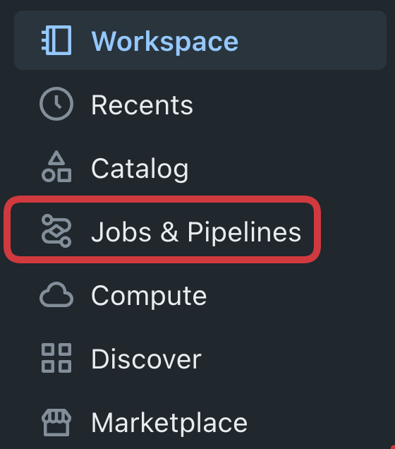
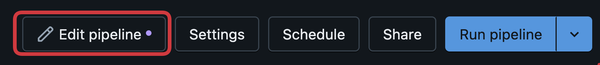
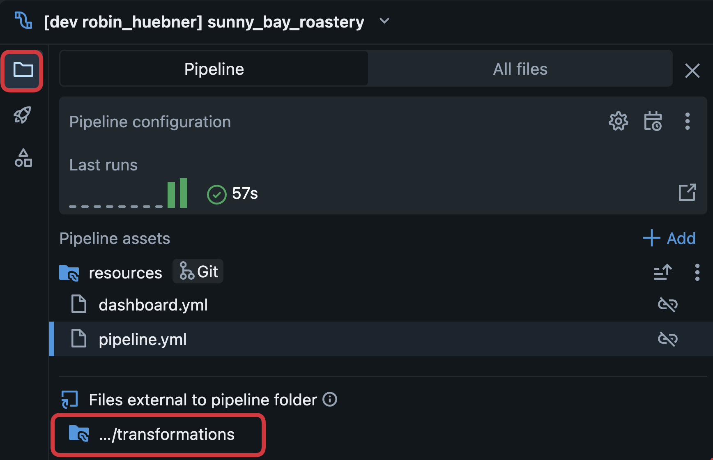
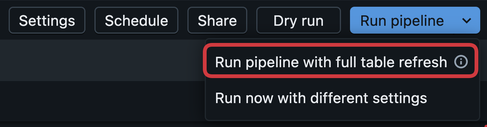
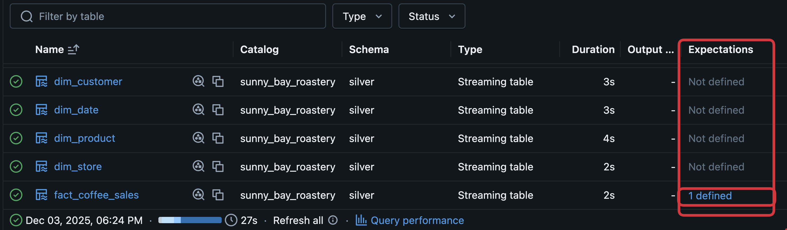
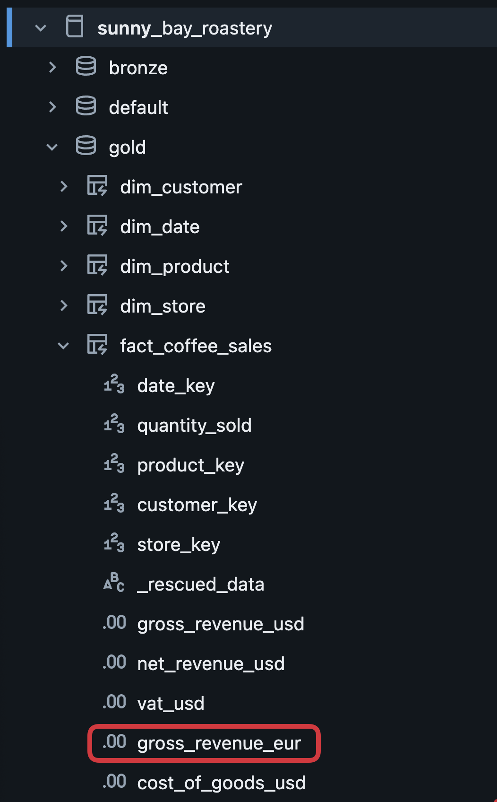

# ☕ Lab 1 – Data Integration and Transformation

## 🎯 Learning Objectives
By the end of this lab, you will:
- Understand how Databricks Spark Declarative Pipelines orchestrate medallion‑architecture data processing  
- Modify SQL-based transformation logic in the **silver** and **gold** layers  
- Add data quality constraints using SDP’s declarative expectations  
- Extend the data model with new calculated fields  
- Create a small aggregated gold table for reporting purposes  
- Trigger and observe a full pipeline run

## Introduction

**What Are Spark Declarative Pipelines?**

Spark Declarative Pipelines (SDP) enable data transformations using simple, intuitive SQL files.  
They provide:

- Automated orchestration of silver and gold layers  
- Built-in data quality and constraint handling  
- SQL-only development workflows  
- Automatic table creation and lineage tracking  

SDP allows non-engineers to safely contribute to data transformation logic.

**Why Use Declarative Pipelines?**

- SQL-only transformations simplify development  
- Data quality rules ensure trustworthy outputs  
- Pipelines automatically build medallion layers end-to-end  
- Results immediately become available in Unity Catalog  
- Perfect starting point for Analytics, Metric Views, and Dashboards  

## Instructions

### Add a Data Quality Constraint to the Silver Layer
1. Open **Jobs & Pipelines** in the Databricks UI
<div style="text-align:left;">
  
</div>
2. Click on the pipeline with the **suffix sunny_bay_roastery**
3. Explore the Pipeline Monitoring UI
4. Click on "Edit Pipeline" and confirm to open the source code
<div style="text-align:left;">
  
</div>
5. Expand the Worspace and open the transformations folder
<div style="text-align:left;">
  
</div>
6. Open **`silver.sql`** and ensure that invalid quantities are removed before silver by adding the following constraint to the table **fact_coffee_sales**:
```sql
CONSTRAINT valid_quantity EXPECT (quantity_sold > 0) ON VIOLATION DROP ROW
```
7. This ensures that downstream analytics do not include negative or zero-sold quantities.
8. You can confirm your code with this example solution:
```sql
CREATE OR REFRESH STREAMING TABLE silver.fact_coffee_sales (
  CONSTRAINT valid_quantity EXPECT (quantity_sold > 0) ON VIOLATION DROP ROW
) AS
SELECT
    *
FROM STREAM read_files(
  '/Volumes/${catalog}/bronze/raw/fact_coffee_sales/',
  format => 'parquet'
);
```
9. Run the pipeline with a full table refresh to re-process all the data
<div style="text-align:left;">
  
</div>
10. Analyse the effect of the expectation column
<div style="text-align:left;">
  
</div>

### Add a New Derived Column (Gross Revenue in EUR)

1. Make sure you are now in the file **`gold.sql`**
2. Add a new calculated column to the table **fact_coffee_sales** that computes gross revenue in EUR using a fixed conversion rate of **1.1**:

```sql
(dp.list_price_usd * fcs.quantity_sold) * 1.1 AS gross_revenue_eur
```
3. This mirrors the USD metric and prepares multi‑currency reporting.
4. Run the pipeline **without** a full table refresh to re-process all the data
5. Find the new column in the Unity Catalog
<div style="text-align:left;">
  
</div>

### Create a New Aggregated Gold Table for Annual Revenue

1. At the bottom of **`gold.sql`**, add a new gold table that aggregates revenue by year:

```sql
CREATE OR REFRESH TABLE gold.total_revenue_by_year AS
SELECT
    YEAR(order_date) AS order_year,
    SUM(gross_revenue_usd) AS total_gross_revenue_usd,
    SUM(gross_revenue_eur) AS total_gross_revenue_eur
FROM gold.fact_coffee_sales
GROUP BY YEAR(order_date);
```
2. Run the pipeline **without** a full table refresh to see how SDP only processes the required table
3. Congratulations, the data is ready to be analyzed


## What Happens Next?

You have successfully enhanced the transformation logic of your Lakehouse pipeline.  
Your gold tables now include:

- Data quality enforcement  
- Extended business logic (EUR revenue)  
- Aggregated yearly metrics  

These enriched datasets will be used in **Lab 2**, where you will build Metric Views on top of this refined gold layer.
